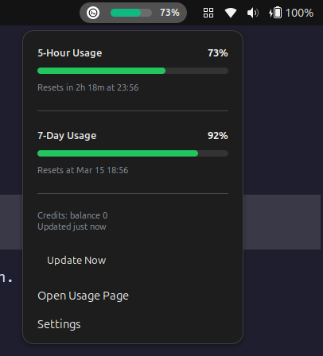

# Codex Usage GNOME Extension

A GNOME Shell extension that displays Codex usage in the top panel using the same backend endpoint that Codex itself uses.



## Data source

The extension:

- reads `~/.codex/auth.json` by default
- uses the access token and account id stored there
- calls `https://chatgpt.com/backend-api/wham/usage`

It displays:

- 5-hour Codex usage
- 7-day Codex usage
- optional code-review usage when present
- plan and credit information

## Local test script

The repository also includes `fetch_codex_status.py`, which makes the same request from the terminal:

```bash
./fetch_codex_status.py
```

## Manual install

```bash
mkdir -p ~/.local/share/gnome-shell/extensions/codex-usage@artur.dev
cp -r . ~/.local/share/gnome-shell/extensions/codex-usage@artur.dev
glib-compile-schemas ~/.local/share/gnome-shell/extensions/codex-usage@artur.dev/schemas
```

Then restart GNOME Shell or log out and back in, and enable the extension.
